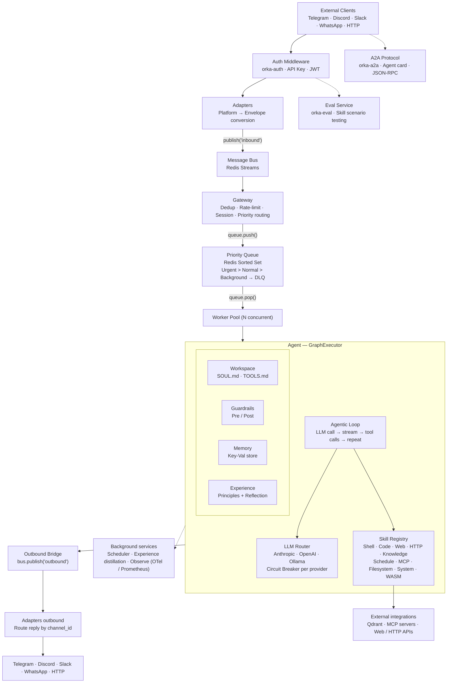

# Orka

[](https://github.com/gianlucamazza/orka/actions/workflows/ci.yml)
[](LICENSE-MIT)
[](LICENSE-APACHE)
[](https://www.rust-lang.org)

A self-learning AI agent orchestration platform built in Rust.

Orka routes messages from Telegram, Discord, Slack, WhatsApp, and HTTP through a priority queue to LLM-powered agents. Agents execute tools, build knowledge via RAG, learn from experience, and coordinate through multi-agent graphs — extensible with WASM plugins and MCP/A2A protocols.

<p align="center">
  
</p>

<details>
<summary>More demos</summary>

### Real-time dashboard

<p align="center">
  
</p>

### Server status &amp; skill listing

<p align="center">
  
</p>

### One-shot message

<p align="center">
  
</p>

</details>

Demo assets are regenerated with `just demo-check`, `just demo`, or `./scripts/demo.sh build <scenario>`. The asset contract and environment setup live in [demo/README.md](demo/README.md).

## Architecture



For a detailed description of each subsystem and their interactions, see [docs/reference/architecture.md](docs/reference/architecture.md).

## Features

- **Multi-channel messaging** — Telegram, Discord, Slack, WhatsApp, custom HTTP/WebSocket
- **Priority queue** — Redis Sorted Sets with Urgent / Normal / Background lanes
- **LLM integration** — Anthropic Claude, OpenAI, and Ollama (OpenAI-compatible) with streaming support
- **Skill system** — Pluggable skills with schema validation and WASM plugin support
- **MCP server** — Model Context Protocol over JSON-RPC 2.0
- **A2A protocol** — Agent-to-Agent communication
- **Agent router** — Prefix-based routing with delegation
- **Workspace config** — Hot-reloadable agent configuration (SOUL.md, TOOLS.md)
- **Knowledge base** — RAG with Qdrant vector store and document ingestion
- **Sandboxed execution** — Process isolation and WASM sandboxing
- **Guardrails** — Input/output validation and content filtering
- **Checkpointing** — Per-node execution checkpoints with crash recovery and human-in-the-loop approval
- **Multi-agent graphs** — Fan-out/fan-in, state reducers, planning mode, rolling-window history
- **Multi-modal** — Vision support for image messages across LLM providers
- **Circuit breaker** — Resilience pattern for external services
- **Observability** — OpenTelemetry tracing, Prometheus metrics, Swagger UI, append-only JSONL audit log
- **Security** — JWT/API key auth, AES-256-GCM secret encryption, SSRF protection
- **Scheduler** — Cron-based recurring tasks
- **Self-learning** — Trajectory recording, principle reflection, and offline distillation
- **Soft skills** — Instruction-based SKILL.md skills injected into the agent system prompt
- **MCP HTTP transport** — Streamable HTTP (MCP spec 2025-03-26) with OAuth 2.1 Client Credentials
- **Skill evaluation** — TOML-based scenario runner for offline skill testing (`orka-eval`)
- **WASM Component Model** — Plugin SDK based on the WIT interface definition language
- **CLI** — Full-featured management tool with real-time TUI dashboard

## Quick Start

### Prerequisites

- Rust 1.91+
- Redis 7+
- Docker (optional)

### With Docker Compose

Copy `.env.example` to `.env` and fill in any required values, then:

```bash
docker compose up
```

### Manual Setup

```bash
# Start Redis (or Valkey — a fully compatible drop-in replacement)
docker run -d -p 6379:6379 redis:7-alpine

# Build and run
cargo build --release
./target/release/orka-server
```

### Native Installation (Linux with systemd)

```bash
# Dev setup — installs common deps, starts Redis/Valkey, runs cargo check
just setup

# Production install — builds release binary, installs systemd service
just install
systemctl enable --now orka-server

# Uninstall (preserves config and data)
just uninstall
```

`just setup` supports common `pacman`, `apt`, and `dnf` based development environments. Native Arch packaging is also available via `PKGBUILD`.

The server starts two endpoints:

- `http://localhost:8080` — Health endpoint
- `http://localhost:8081` — Custom HTTP/WebSocket adapter

### Send a message

```bash
curl -X POST http://localhost:8081/api/v1/message \
  -H "Content-Type: application/json" \
  -d '{"channel": "custom", "text": "Hello, Orka!"}'
```

## Configuration

Orka reads configuration from `orka.toml` and `ORKA_*` environment variables.
The repository root `orka.toml` is the canonical sample config kept in sync with
the current parser.

For a complete reference of all configuration options, see the [Configuration Guide](docs/reference/configuration.md).

### Environment Variables

| Variable                     | Description                                             |
| ---------------------------- | ------------------------------------------------------- |
| `ORKA_CONFIG`                | Path to config file (default: `./orka.toml`)            |
| `ORKA_ENV_FILE`              | Path to `.env` file for hot-reload                      |
| `ORKA_ENV` / `APP_ENV`       | `production` requires encryption key for secrets        |
| `ORKA_SECRET_ENCRYPTION_KEY` | 32-byte hex key for AES-256-GCM secret encryption       |
| `ORKA_HOST_HOSTNAME`         | Override hostname in system info                        |
| `ORKA_SERVER_URL`            | CLI: server endpoint (default `http://127.0.0.1:8080`)  |
| `ORKA_ADAPTER_URL`           | CLI: adapter endpoint (default `http://127.0.0.1:8081`) |
| `ORKA_API_KEY`               | CLI: API key for authenticated requests                 |
| `ANTHROPIC_API_KEY`          | Anthropic provider fallback                             |
| `MOONSHOT_API_KEY`           | Moonshot provider fallback                              |
| `OPENAI_API_KEY`             | OpenAI provider fallback                                |
| `TAVILY_API_KEY`             | Tavily web search key                                   |
| `BRAVE_API_KEY`              | Brave web search key                                    |
| `RUST_LOG`                   | Overrides `logging.level` via tracing `EnvFilter`       |
| `ORKA_GIT_SHA`               | Git SHA embedded at build time                          |
| `ORKA_BUILD_DATE`            | Build date embedded at build time                       |
| `ORKA_NO_UPDATE_CHECK`       | Disable automatic update check on CLI startup           |

Config fields can also be overridden via `ORKA__<SECTION>__<KEY>` (e.g., `ORKA__REDIS__URL`).

### API Endpoints

**Server (`:8080`):**

| Method   | Path                            | Description                                          |
| -------- | ------------------------------- | ---------------------------------------------------- |
| `GET`    | `/health`                       | Health check                                         |
| `GET`    | `/health/live`                  | Liveness probe                                       |
| `GET`    | `/health/ready`                 | Readiness probe                                      |
| `GET`    | `/metrics`                      | Prometheus metrics (when `observe.backend = "otlp"` or `prometheus`) |
| `GET`    | `/docs`                         | Swagger UI (OpenAPI)                                 |
| `GET`    | `/api/v1/version`               | Version info                                         |
| `GET`    | `/api/v1/info`                  | Server info and feature flags                        |
| `GET`    | `/api/v1/dlq`                   | List dead-letter entries                             |
| `DELETE` | `/api/v1/dlq`                   | Purge dead-letter queue                              |
| `POST`   | `/api/v1/dlq/{id}/replay`       | Replay a dead-letter entry                           |
| `GET`    | `/api/v1/skills`                | List registered skills                               |
| `GET`    | `/api/v1/soft-skills`           | List discovered soft skills                          |
| `GET`    | `/api/v1/skills/{name}`         | Skill detail with schema                             |
| `POST`   | `/api/v1/eval`                  | Run eval scenarios                                   |
| `GET`    | `/api/v1/schedules`             | List scheduled tasks                                 |
| `POST`   | `/api/v1/schedules`             | Create a schedule                                    |
| `DELETE` | `/api/v1/schedules/{id}`        | Delete a schedule                                    |
| `GET`    | `/api/v1/workspaces`            | List server workspaces                               |
| `GET`    | `/api/v1/workspaces/{name}`     | Workspace detail                                     |
| `GET`    | `/api/v1/graph`                 | Agent graph topology                                 |
| `GET`    | `/api/v1/experience/status`     | Experience system status                             |
| `GET`    | `/api/v1/experience/principles` | Retrieve learned principles                          |
| `POST`   | `/api/v1/experience/distill`    | Trigger principle distillation                       |
| `GET`    | `/api/v1/sessions`              | List active sessions                                 |
| `GET`    | `/api/v1/sessions/{id}`         | Session detail                                       |
| `DELETE` | `/api/v1/sessions/{id}`         | Delete a session                                     |
| `GET`    | `/api/v1/runs/{run_id}/checkpoints`        | List checkpoint IDs for a run           |
| `GET`    | `/api/v1/runs/{run_id}/checkpoints/latest` | Most recent checkpoint                  |
| `GET`    | `/api/v1/runs/{run_id}/status`             | Run status from latest checkpoint       |
| `POST`   | `/api/v1/runs/{run_id}/approve`            | Approve an interrupted run (HITL)       |
| `POST`   | `/api/v1/runs/{run_id}/reject`             | Reject an interrupted run (HITL)        |

**Adapter (`:8081`):**

| Method | Path              | Description          |
| ------ | ----------------- | -------------------- |
| `POST` | `/api/v1/message` | Send a message       |
| `GET`  | `/api/v1/ws`      | WebSocket connection |
| `GET`  | `/api/v1/health`  | Adapter health       |

> **Hot-reload**: Orka watches the `.env` file for changes. API key updates trigger automatic LLM client refresh without restart.

## Workspaces

Agent behavior is configured through workspace files:

- `SOUL.md` — Agent personality and system prompt (markdown with YAML frontmatter)
- `TOOLS.md` — Tool usage guidelines for the LLM (plain markdown)

Runtime parameters (model, tokens, etc.) live in `orka.toml` under `[[agents]]` and `[tools]`.

Orka currently uses a two-tier workspace model:

- **Local repository workspace** — the root `SOUL.md` and `TOOLS.md` discovered from the current working tree by local tooling and CLI flows.
- **Built-in runtime workspaces** — distributable workspace files under `workspaces/`, used by runtime registration and installation.

These are related but not interchangeable concepts. The root files define the local repo's active workspace context, while `workspaces/` stores built-in workspace content shipped with the system.

Workspaces support hot-reloading via filesystem watcher.

## Documentation

Use the [Documentation Index](docs/README.md) as the canonical navigation hub.
The table below is a curated subset of the most common entrypoints.

| Guide                                          | Description                                               |
| ---------------------------------------------- | --------------------------------------------------------- |
| [Architecture](docs/reference/architecture.md) | End-to-end message flow and subsystem overview            |
| [Deployment](docs/reference/deployment.md)     | Docker, bare-metal, systemd, reverse proxy, observability |
| [Configuration](docs/reference/configuration.md) | Detailed reference for `orka.toml` and env vars         |
| [CLI Reference](docs/reference/cli-reference.md) | Current commands and flags exposed by the `orka` binary |
| [Prompt Architecture](docs/guides/agents.md)   | Guide to the prompt pipeline, templates, and Workspaces   |
| [Skill Development](docs/guides/skill-development.md) | Built-in, WASM, and soft skills; eval framework     |
| [WASM Tutorial](docs/guides/tutorials/build-a-wasm-plugin.md) | Step-by-step guide to writing WebAssembly plugins |
| [MCP Guide](docs/reference/mcp-guide.md)       | MCP client/server, HTTP transport, OAuth                  |
| [Experience System](docs/guides/experience-system.md) | Self-learning loop, reflection, distillation        |
| [Eval Framework](docs/guides/eval-guide.md)    | TOML scenario runner for offline skill testing            |
| [Security](SECURITY.md)                        | Vulnerability reporting, hardening checklist              |

Internal-only or preview material lives under `docs/internal/` or is explicitly
marked as preview when it documents code paths that are not currently exposed by
the public CLI.

Companion docs that sit outside `docs/` are also indexed from [docs/README.md](docs/README.md), including examples, packaging, SDK, tooling, tests, and selected crate-local READMEs.

## Development

```bash
# Run all tests
cargo test --workspace

# Run with Redis integration tests
cargo test --workspace -- --ignored

# Check formatting
cargo fmt --all -- --check

# Lint
cargo clippy --workspace --all-targets
```

## CLI

The `orka` command-line tool provides a full suite of management commands for server administration, agent operations, and observability.

For a complete list of commands and global options, see the [CLI Reference](docs/reference/cli-reference.md).

## Project Structure

Curated overview of the main repository areas; this is intentionally not an
exhaustive listing of every workspace package.

```
orka/
├── crates/
│   ├── orka-core/            # Shared types, traits, errors
│   ├── orka-infra/           # Message bus, queue, session, conversation (Redis)
│   ├── orka-auth/            # JWT and API key authentication
│   ├── orka-worker/          # Worker pool & handlers
│   ├── orka-gateway/         # Inbound message gateway
│   ├── orka-observe/         # Domain event observability
│   ├── orka-skills/          # Skill registry & execution
│   ├── orka-memory/          # Key-value memory store
│   ├── orka-secrets/         # Secret management (AES-256-GCM)
│   ├── orka-workspace/       # Workspace loader & watcher
│   ├── orka-llm/             # LLM providers (Anthropic, Moonshot, OpenAI, Ollama)
│   ├── orka-mcp/             # Model Context Protocol server
│   ├── orka-a2a/             # Agent-to-Agent protocol
│   ├── orka-guardrails/      # Input/output guardrails
│   ├── orka-circuit-breaker/ # Circuit breaker pattern
│   ├── orka-web/             # Web search, page reading, and HTTP client skills
│   ├── orka-os/              # OS integration skills
│   ├── orka-knowledge/       # RAG & vector knowledge base
│   ├── orka-scheduler/       # Cron-based task scheduler
│   ├── orka-experience/      # Self-learning experience system
│   ├── orka-agent/           # Agent orchestration and routing
│   ├── orka-wasm/            # WASM runtime utilities, Component Model, and code sandbox
│   ├── orka-checkpoint/      # Execution checkpointing and crash recovery
│   ├── orka-eval/            # Skill evaluation framework (TOML scenarios)
│   ├── orka-cli/             # CLI tool
│   └── orka-adapter-*/       # Channel adapters
├── sdk/
│   ├── orka-plugin-sdk/          # WASM module plugin SDK
│   ├── orka-plugin-sdk-component/ # WASM Component Model plugin SDK (WIT-based)
│   └── hello-plugin/             # Example WASM plugin
├── docs/
│   ├── reference/            # Stable reference docs
│   ├── guides/               # How-tos and development guides
│   └── internal/             # Internal analysis and planning docs
├── evals/                    # Built-in evaluation scenarios (*.eval.toml)
├── examples/                 # Runnable examples and integration samples
├── deploy/                   # systemd service unit, sysusers, tmpfiles, sudoers
├── workspaces/               # Built-in workspace prompt files used by the runtime
├── tools/claude-channel/     # MCP bridge for Claude Code ↔ Orka integration (TypeScript/Bun)
├── tests/                    # Reserved for end-to-end and cross-crate integration tests
└── scripts/                  # install.sh and setup-dev.sh
```

## Root Conventions

The repository root is intentionally kept as the composition layer of the project.

- Keep product code in `crates/`, not in ad hoc top-level folders.
- Keep stable entrypoints and repo-wide manifests in root: `Cargo.toml`, `orka.toml`, `Justfile`, `Dockerfile`, `docker-compose*.yml`.
- Keep repository-wide policy and tooling config in root: `.editorconfig`, `.rustfmt.toml`, `deny.toml`, `release.toml`, `cliff.toml`, `.pre-commit-config.yaml`.
- Keep user-facing examples, SDKs, docs, deploy assets, and scripts in their dedicated top-level directories.
- Treat `workspaces/` as a runtime data area for built-in workspace prompt files, not as a general development folder.
- Treat root `SOUL.md` and `TOOLS.md` as the local repository workspace, distinct from the built-in workspaces stored under `workspaces/`.
- Use `scripts/` for shell automation and installation flows.
- Use `tools/` for standalone helper utilities with their own runtime or toolchain.
- Reserve `tests/` for end-to-end or cross-crate tests. Crate-local unit and integration tests should stay inside each crate.

Some root files exist for local tool integration rather than core runtime architecture, such as `.mcp.json`, `.claude/`, and `GEMINI.md`. They should remain documented and intentional, but they are not the primary model for organizing product code.

## Privacy

Orka does not collect telemetry, usage data, or analytics of any kind. No data leaves your infrastructure unless you explicitly configure it to do so.

- **LLM API calls** are made directly from your deployment to the provider you configure (Anthropic, Moonshot, OpenAI, Ollama, etc.). Orka does not proxy or inspect these requests.
- **Messages and sessions** are stored in your own Redis instance. Nothing is sent to third-party services without your configuration.
- **WASM plugins** run in a sandboxed environment with explicit memory and CPU limits. They cannot make outbound network calls unless the host grants access.
- **Knowledge base** (RAG) data is stored in your own Qdrant instance.

You are in full control of what enters and exits the system.

## License

Licensed under either of

- [Apache License, Version 2.0](LICENSE-APACHE)
- [MIT License](LICENSE-MIT)

at your option.
