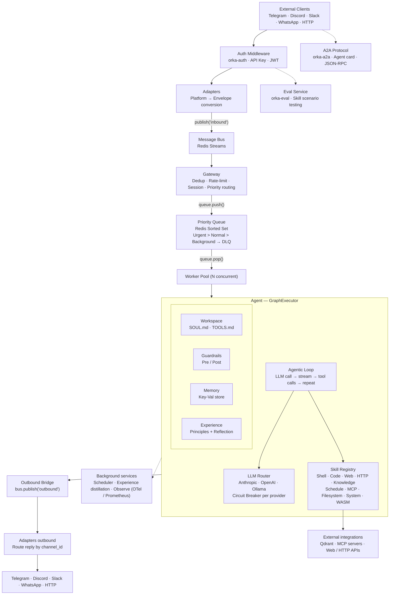

# Orka

[](https://github.com/gianlucamazza/orka/actions/workflows/ci.yml)
[](LICENSE-MIT)
[](LICENSE-APACHE)
[](https://www.rust-lang.org)

A self-learning AI agent orchestration platform built in Rust.

Orka routes messages from Telegram, Discord, Slack, WhatsApp, and HTTP through a priority queue to LLM-powered agents. Agents execute tools, build knowledge via RAG, learn from experience, and coordinate through multi-agent graphs — extensible with WASM plugins and MCP/A2A protocols.

<p align="center">
  
</p>

<details>
<summary>More demos</summary>

### Real-time dashboard

<p align="center">
  
</p>

### Server status &amp; skill listing

<p align="center">
  
</p>

### One-shot message

<p align="center">
  
</p>

</details>

## Architecture



For a detailed description of each subsystem and their interactions, see [docs/architecture.md](docs/architecture.md).

## Features

- **Multi-channel messaging** — Telegram, Discord, Slack, WhatsApp, custom HTTP/WebSocket
- **Priority queue** — Redis Sorted Sets with Urgent / Normal / Background lanes
- **LLM integration** — Anthropic Claude, OpenAI, and Ollama (OpenAI-compatible) with streaming support
- **Skill system** — Pluggable skills with schema validation and WASM plugin support
- **MCP server** — Model Context Protocol over JSON-RPC 2.0
- **A2A protocol** — Agent-to-Agent communication
- **Agent router** — Prefix-based routing with delegation
- **Workspace config** — Hot-reloadable agent configuration (SOUL.md, TOOLS.md)
- **Knowledge base** — RAG with Qdrant vector store and document ingestion
- **Sandboxed execution** — Process isolation and WASM sandboxing
- **Guardrails** — Input/output validation and content filtering
- **Circuit breaker** — Resilience pattern for external services
- **Observability** — OpenTelemetry tracing, Prometheus metrics, Swagger UI, append-only JSONL audit log
- **Security** — JWT/API key auth, AES-256-GCM secret encryption, SSRF protection
- **Scheduler** — Cron-based recurring tasks
- **Self-learning** — Trajectory recording, principle reflection, and offline distillation
- **Soft skills** — Instruction-based SKILL.md skills injected into the agent system prompt
- **MCP HTTP transport** — Streamable HTTP (MCP spec 2025-03-26) with OAuth 2.1 Client Credentials
- **Skill evaluation** — TOML-based scenario runner for offline skill testing (`orka-eval`)
- **WASM Component Model** — Plugin SDK based on the WIT interface definition language
- **CLI** — Full-featured management tool with real-time TUI dashboard

## Quick Start

### Prerequisites

- Rust 1.85+
- Redis 7+
- Docker (optional)

### With Docker Compose

Copy `.env.example` to `.env` and fill in any required values, then:

```bash
docker compose up
```

### Manual Setup

```bash
# Start Redis (or Valkey — a fully compatible drop-in replacement)
docker run -d -p 6379:6379 redis:7-alpine

# Build and run
cargo build --release
./target/release/orka-server
```

### Native Installation (Arch Linux)

```bash
# Dev setup — installs deps, starts Redis, runs cargo check
just setup

# Production install — builds release binary, installs systemd service
just install
systemctl enable --now orka-server

# Uninstall (preserves config and data)
just uninstall
```

The server starts two endpoints:

- `http://localhost:8080` — Health endpoint
- `http://localhost:8081` — Custom HTTP/WebSocket adapter

### Send a message

```bash
curl -X POST http://localhost:8081/api/v1/message \
  -H "Content-Type: application/json" \
  -d '{"channel": "custom", "text": "Hello, Orka!"}'
```

## Configuration

Orka reads configuration from `orka.toml` and `ORKA_*` environment variables.

| Section                   | Key                       | Default                  | Description                                                             |
| ------------------------- | ------------------------- | ------------------------ | ----------------------------------------------------------------------- |
| `server`                  | `host`                    | `127.0.0.1`              | Health endpoint bind address                                            |
| `server`                  | `port`                    | `8080`                   | Health endpoint port                                                    |
| `redis`                   | `url`                     | `redis://127.0.0.1:6379` | Redis connection URL                                                    |
| `worker`                  | `concurrency`             | `4`                      | Number of concurrent workers                                            |
| `session`                 | `ttl_secs`                | `86400`                  | Session TTL in seconds (24h)                                            |
| `queue`                   | `max_retries`             | `3`                      | Max retries before dead-letter                                          |
| `adapters.custom`         | `host`                    | `127.0.0.1`              | Custom adapter bind address                                             |
| `adapters.custom`         | `port`                    | `8081`                   | Custom adapter port                                                     |
| `adapters.telegram`       | `bot_token_secret`        | —                        | Secret path for bot token                                               |
| `adapters.telegram`       | `mode`                    | `polling`                | `polling` or `webhook`                                                  |
| `adapters.telegram`       | `parse_mode`              | `HTML`                   | Outbound text format                                                    |
| `adapters.telegram`       | `webhook_url`             | —                        | Public URL for webhook mode                                             |
| `adapters.telegram`       | `webhook_port`            | `8443`                   | Local port for webhook listener                                         |
| `auth`                    | `enabled`                 | `false`                  | Enable API key authentication                                           |
| `sandbox`                 | `backend`                 | `process`                | Sandbox backend (`process` or `wasm`)                                   |
| `logging`                 | `level`                   | `info`                   | Log level                                                               |
| `logging`                 | `json`                    | `false`                  | JSON log format                                                         |
| `agent`                   | `id`                      | `orka-default`           | Agent identifier                                                        |
| `agent`                   | `max_iterations`          | `10`                     | Max agentic loop iterations per turn                                    |
| `agent`                   | `heartbeat_interval_secs` | —                        | Streaming heartbeat interval (optional)                                 |
| `llm`                     | `timeout_secs`            | `30`                     | LLM request timeout                                                     |
| `llm`                     | `max_tokens`              | `8192`                   | Default max output tokens                                               |
| `llm.providers`           | `name`                    | —                        | Provider name (array of provider configs)                               |
| `knowledge`               | `enabled`                 | `false`                  | Enable RAG/knowledge base                                               |
| `knowledge.vector_store`  | `provider`                | `qdrant`                 | Vector store backend                                                    |
| `knowledge.vector_store`  | `url`                     | `http://localhost:6334`  | Qdrant endpoint                                                         |
| `scheduler`               | `enabled`                 | `false`                  | Enable cron scheduler                                                   |
| `scheduler`               | `poll_interval_secs`      | `5`                      | Scheduler polling interval                                              |
| `web`                     | `search_provider`         | `none`                   | Web search backend (`tavily`, `brave`, `searxng`, or `none`)            |
| `os`                      | `enabled`                 | `false`                  | Enable OS integration skills                                            |
| `os`                      | `permission_level`        | `read-only`              | OS skill permission level                                               |
| `http`                    | `enabled`                 | `false`                  | Enable HTTP request skill                                               |
| `plugins`                 | `dir`                     | —                        | Directory for WASM plugin files (optional)                              |
| `guardrails`              | `blocked_keywords`        | `[]`                     | Keywords that trigger message blocking                                  |
| `guardrails`              | `pii_filter`              | `false`                  | Enable PII redaction                                                    |
| `mcp.servers`             | `name`                    | —                        | MCP server name (array of server configs)                               |
| `mcp.servers`             | `command`                 | —                        | Command to launch MCP server                                            |
| `mcp.serve`               | `enabled`                 | `false`                  | Expose Orka as an MCP server                                            |
| `mcp.serve`               | `transport`               | `stdio`                  | `stdio` or `sse`                                                        |
| `mcp.servers[].transport` | `type`                    | `stdio`                  | `stdio` or `streamable_http` (MCP spec 2025-03-26)                      |
| `mcp.servers[].transport` | `url`                     | —                        | HTTP endpoint for `streamable_http` transport                           |
| `mcp.servers[].transport` | `auth.token_url`          | —                        | OAuth 2.1 token endpoint (optional)                                     |
| `mcp.servers[].transport` | `auth.client_id`          | —                        | OAuth 2.1 client ID                                                     |
| `mcp.servers[].transport` | `auth.client_secret_env`  | —                        | Env var holding the OAuth client secret                                 |
| `mcp.servers[].transport` | `auth.scopes`             | `[]`                     | OAuth scopes to request                                                 |
| `bus`                     | `backend`                 | `redis`                  | Message bus backend (`redis`, `nats`, or `memory`)                      |
| `bus`                     | `block_ms`                | `5000`                   | XREADGROUP BLOCK timeout (ms)                                           |
| `bus`                     | `batch_size`              | `10`                     | Messages per read batch                                                 |
| `memory`                  | `backend`                 | `auto`                   | `redis`, `memory`, or `auto`                                            |
| `session`                 | `backend`                 | `auto`                   | `redis`, `memory`, or `auto`                                            |
| `queue`                   | `backend`                 | `auto`                   | `redis`, `memory`, or `auto`                                            |
| `observe`                 | `backend`                 | `log`                    | `log`, `redis`, or `otel`                                               |
| `agent`                   | `max_history_entries`     | `50`                     | Max conversation turns kept in context                                  |
| `agent`                   | `skill_timeout_secs`      | `120`                    | Per-skill execution timeout                                             |
| `agent`                   | `temperature`             | —                        | LLM sampling temperature (0.0–2.0)                                      |
| `agent`                   | `thinking_budget_tokens`  | —                        | Anthropic extended thinking budget                                      |
| `agent`                   | `reasoning_effort`        | —                        | OpenAI o-series: `low`, `medium`, `high`                                |
| `experience`              | `enabled`                 | `false`                  | Enable self-learning experience loop                                    |
| `experience`              | `reflect_on`              | `failures`               | `failures`, `all`, or `sampled`                                         |
| `experience`              | `max_principles`          | `5`                      | Max principles injected into system prompt                              |
| `a2a`                     | `enabled`                 | `false`                  | Enable Agent-to-Agent protocol                                          |
| `os`                      | `sensitive_env_patterns`  | glob list                | Env var patterns redacted from tool output                              |
| `os`                      | `allowed_commands`        | `[]`                     | Explicit command allow-list for OS skills                               |
| `os`                      | `allowed_paths`           | `["/home", "/tmp"]`      | Filesystem access allow-list                                            |
| `os`                      | `blocked_paths`           | (see orka.toml)          | Filesystem access deny-list                                             |
| `os`                      | `blocked_commands`        | (see orka.toml)          | Dangerous command deny-list                                             |
| `os`                      | `max_file_size_bytes`     | `10485760`               | Max file size for reads (10 MB)                                         |
| `os`                      | `shell_timeout_secs`      | `30`                     | Shell command timeout                                                   |
| `os.sudo`                 | `enabled`                 | `false`                  | Enable sudo operations                                                  |
| `os.sudo`                 | `require_confirmation`    | `true`                   | Require user confirmation for sudo                                      |
| `os.claude_code`          | `enabled`                 | `"auto"`                 | Auto-detect claude CLI on PATH (`"true"`/`"false"` to override)         |
| `os.claude_code`          | `model`                   | —                        | Claude model override (e.g. `claude-sonnet-4-6`)                        |
| `os.claude_code`          | `max_turns`               | —                        | Max agentic turns per task                                              |
| `os.claude_code`          | `timeout_secs`            | `300`                    | Subprocess timeout in seconds                                           |
| `os.claude_code`          | `working_dir`             | —                        | Working directory for the subprocess                                    |
| `os.claude_code`          | `system_prompt`           | —                        | Instructions appended via `--append-system-prompt`                      |
| `os.claude_code`          | `allowed_tools`           | `[]`                     | Tool allowlist for Claude Code (`--allowedTools`); empty = unrestricted |
| `os.claude_code`          | `inject_context`          | `true`                   | Auto-inject workspace info (cwd) into the task prompt                   |
| `gateway`                 | `rate_limit`              | `60`                     | Max messages per 60s window per session                                 |
| `gateway`                 | `dedup_ttl_secs`          | `3600`                   | Duplicate message detection window                                      |
| `sandbox.limits`          | `timeout_secs`            | `30`                     | Execution timeout                                                       |
| `sandbox.limits`          | `max_memory_bytes`        | `67108864`               | Memory limit (64 MB)                                                    |
| `sandbox.limits`          | `max_output_bytes`        | `1048576`                | Output limit (1 MB)                                                     |
| `soft_skills`             | `dir`                     | —                        | Directory of SKILL.md soft-skill subdirectories                         |
| `audit`                   | `enabled`                 | `false`                  | Enable skill invocation audit log                                       |
| `audit`                   | `output`                  | `file`                   | Audit backend: `file` (JSONL) or `redis`                                |
| `audit`                   | `path`                    | `orka-audit.jsonl`       | Output path for file-based audit log                                    |
| `tools`                   | `disabled`                | `[]`                     | Skill names to disable                                                  |
| `secrets`                 | `encryption_key_env`      | —                        | Env var name for encryption key                                         |
| `auth`                    | `api_key_header`          | `X-Api-Key`              | Header name for API key auth                                            |
| `worker`                  | `retry_base_delay_ms`     | `5000`                   | Base delay for exponential backoff                                      |
| `memory`                  | `max_entries`             | `10000`                  | Max key-value memory entries                                            |
| `observe`                 | `batch_size`              | `50`                     | Event batch size before flush                                           |
| `observe`                 | `flush_interval_ms`       | `100`                    | Flush interval (ms)                                                     |
| `knowledge.embeddings`    | `provider`                | `local`                  | Embedding provider                                                      |
| `knowledge.embeddings`    | `model`                   | `BAAI/bge-small-en-v1.5` | Embedding model                                                         |
| `knowledge.chunking`      | `chunk_size`              | `1000`                   | Characters per chunk                                                    |
| `knowledge.chunking`      | `chunk_overlap`           | `200`                    | Overlap between chunks                                                  |
| `scheduler`               | `max_concurrent`          | `4`                      | Max concurrent scheduled tasks                                          |
| `llm`                     | `model`                   | `claude-sonnet-4-6`      | Global default model                                                    |
| `llm`                     | `max_retries`             | `2`                      | LLM request retries                                                     |
| `llm`                     | `context_window_tokens`   | `1000000`                | Context window size                                                     |
| `web`                     | `max_read_chars`          | `20000`                  | Max chars per page read                                                 |
| `web`                     | `max_content_chars`       | `8000`                   | Truncated content limit per page                                        |
| `web`                     | `cache_ttl_secs`          | `3600`                   | Search cache TTL                                                        |
| `http`                    | `max_response_bytes`      | `1048576`                | Max HTTP response size (1 MB)                                           |
| `http`                    | `default_timeout_secs`    | `30`                     | HTTP request timeout                                                    |
| `http`                    | `blocked_domains`         | `["169.254.169.254"]`    | SSRF protection deny-list                                               |
| `agent`                   | `max_tool_result_chars`   | `50000`                  | Truncation limit for tool output                                        |
| `agent`                   | `max_tool_retries`        | `2`                      | Retries before self-correction hint                                     |

For a complete reference, see [`orka.toml`](orka.toml).

### Environment Variables

| Variable                     | Description                                             |
| ---------------------------- | ------------------------------------------------------- |
| `ORKA_CONFIG`                | Path to config file (default: `./orka.toml`)            |
| `ORKA_ENV_FILE`              | Path to `.env` file for hot-reload                      |
| `ORKA_ENV` / `APP_ENV`       | `production` requires encryption key for secrets        |
| `ORKA_SECRET_ENCRYPTION_KEY` | 32-byte hex key for AES-256-GCM secret encryption       |
| `ORKA_HOST_HOSTNAME`         | Override hostname in system info                        |
| `ORKA_SERVER_URL`            | CLI: server endpoint (default `http://127.0.0.1:8080`)  |
| `ORKA_ADAPTER_URL`           | CLI: adapter endpoint (default `http://127.0.0.1:8081`) |
| `ORKA_API_KEY`               | CLI: API key for authenticated requests                 |
| `ANTHROPIC_API_KEY`          | Anthropic provider fallback                             |
| `OPENAI_API_KEY`             | OpenAI provider fallback                                |
| `TAVILY_API_KEY`             | Tavily web search key                                   |
| `BRAVE_API_KEY`              | Brave web search key                                    |
| `RUST_LOG`                   | Overrides `logging.level` via tracing `EnvFilter`       |
| `ORKA_GIT_SHA`               | Git SHA embedded at build time                          |
| `ORKA_BUILD_DATE`            | Build date embedded at build time                       |
| `ORKA_NO_UPDATE_CHECK`       | Disable automatic update check on CLI startup           |

Config fields can also be overridden via `ORKA__<SECTION>__<KEY>` (e.g., `ORKA__REDIS__URL`).

### API Endpoints

**Server (`:8080`):**

| Method   | Path                            | Description                                          |
| -------- | ------------------------------- | ---------------------------------------------------- |
| `GET`    | `/health`                       | Health check                                         |
| `GET`    | `/health/live`                  | Liveness probe                                       |
| `GET`    | `/health/ready`                 | Readiness probe                                      |
| `GET`    | `/metrics`                      | Prometheus metrics (when `observe.backend = "otel"`) |
| `GET`    | `/docs`                         | Swagger UI (OpenAPI)                                 |
| `GET`    | `/api/v1/version`               | Version info                                         |
| `GET`    | `/api/v1/dlq`                   | List dead-letter entries                             |
| `DELETE` | `/api/v1/dlq`                   | Purge dead-letter queue                              |
| `POST`   | `/api/v1/dlq/{id}/replay`       | Replay a dead-letter entry                           |
| `GET`    | `/api/v1/skills`                | List registered skills                               |
| `GET`    | `/api/v1/skills/{name}`         | Skill detail with schema                             |
| `GET`    | `/api/v1/schedules`             | List scheduled tasks                                 |
| `POST`   | `/api/v1/schedules`             | Create a schedule                                    |
| `DELETE` | `/api/v1/schedules/{id}`        | Delete a schedule                                    |
| `GET`    | `/api/v1/workspaces`            | List server workspaces                               |
| `GET`    | `/api/v1/workspaces/{name}`     | Workspace detail                                     |
| `GET`    | `/api/v1/graph`                 | Agent graph topology                                 |
| `GET`    | `/api/v1/experience/status`     | Experience system status                             |
| `GET`    | `/api/v1/experience/principles` | Retrieve learned principles                          |
| `POST`   | `/api/v1/experience/distill`    | Trigger principle distillation                       |
| `GET`    | `/api/v1/sessions`              | List active sessions                                 |
| `GET`    | `/api/v1/sessions/{id}`         | Session detail                                       |
| `DELETE` | `/api/v1/sessions/{id}`         | Delete a session                                     |

**Adapter (`:8081`):**

| Method | Path              | Description          |
| ------ | ----------------- | -------------------- |
| `POST` | `/api/v1/message` | Send a message       |
| `GET`  | `/api/v1/ws`      | WebSocket connection |
| `GET`  | `/api/v1/health`  | Adapter health       |

> **Hot-reload**: Orka watches the `.env` file for changes. API key updates trigger automatic LLM client refresh without restart.

## Workspaces

Agent behavior is configured through workspace files:

- `SOUL.md` — Agent personality and system prompt (markdown with YAML frontmatter)
- `TOOLS.md` — Tool usage guidelines for the LLM (plain markdown)

Runtime parameters (model, tokens, heartbeat, etc.) live in `orka.toml` under `[agent]` and `[tools]`.

Workspaces support hot-reloading via filesystem watcher.

## Documentation

| Guide                                          | Description                                               |
| ---------------------------------------------- | --------------------------------------------------------- |
| [Architecture](docs/architecture.md)           | End-to-end message flow and subsystem overview            |
| [Deployment](docs/deployment.md)               | Docker, bare-metal, systemd, reverse proxy, observability |
| [Skill Development](docs/skill-development.md) | Built-in, WASM, and soft skills; eval framework           |
| [MCP Guide](docs/mcp-guide.md)                 | MCP client/server, HTTP transport, OAuth                  |
| [Experience System](docs/experience-system.md) | Self-learning loop, reflection, distillation              |
| [Eval Framework](docs/eval-guide.md)           | TOML scenario runner for offline skill testing            |
| [Security](SECURITY.md)                        | Vulnerability reporting, hardening checklist              |

## Development

```bash
# Run all tests
cargo test --workspace

# Run with Redis integration tests
cargo test --workspace -- --ignored

# Check formatting
cargo fmt --all -- --check

# Lint
cargo clippy --workspace --all-targets
```

## CLI

```bash
orka health                      # Server health check
orka status                      # Server status (uptime, workers, adapters)
orka ready                       # Readiness probe (exit 1 if not ready)
orka send "Hello"                # Send a message (--session-id, --timeout)
orka chat                        # Interactive session (--session-id)
orka dlq list|replay|purge       # Dead letter queue management
orka secret set|get|list|delete  # Encrypted secret management
orka config check                # Validate orka.toml
orka config migrate              # Schema migration (--dry-run)
orka sudo check                  # Verify sudoers for allowed commands
orka skill list|describe <name>  # Registered skills
orka schedule list|create|delete # Scheduled tasks
orka workspace list|show <name>  # Server workspaces
orka graph show [--dot]          # Agent graph (text or Graphviz DOT)
orka experience status|principles|distill  # Self-learning system
orka session list|show|delete    # Active sessions
orka metrics [--filter] [--json] # Prometheus metrics
orka dashboard [--interval <s>]  # Real-time TUI dashboard (health, metrics, sessions)
orka a2a card|send               # A2A agent card / send task
orka mcp-serve                   # Run as MCP server (stdio)
orka completions <shell>         # Generate completions (bash/zsh/fish)
orka version                     # Show version (--check: exit 1 if update available)
orka update                      # Self-update the CLI binary
```

Global flags: `--server <url>`, `--adapter <url>`, `--api-key <key>` (or env vars above).

## Project Structure

```
orka/
├── orka-server/              # Binary composition root
├── crates/
│   ├── orka-core/            # Shared types, traits, errors
│   ├── orka-bus/             # Message bus (Redis Streams + in-memory)
│   ├── orka-auth/            # JWT and API key authentication
│   ├── orka-session/         # Session store
│   ├── orka-queue/           # Priority queue
│   ├── orka-worker/          # Worker pool & handlers
│   ├── orka-gateway/         # Inbound message gateway
│   ├── orka-observe/         # Domain event observability
│   ├── orka-skills/          # Skill registry & execution
│   ├── orka-sandbox/         # Code execution sandbox (process + WASM)
│   ├── orka-memory/          # Key-value memory store
│   ├── orka-secrets/         # Secret management (AES-256-GCM)
│   ├── orka-workspace/       # Workspace loader & watcher
│   ├── orka-llm/             # LLM providers (Anthropic, OpenAI, Ollama)
│   ├── orka-mcp/             # Model Context Protocol server
│   ├── orka-a2a/             # Agent-to-Agent protocol
│   ├── orka-guardrails/      # Input/output guardrails
│   ├── orka-circuit-breaker/ # Circuit breaker pattern
│   ├── orka-web/             # Web content extraction
│   ├── orka-os/              # OS integration skills
│   ├── orka-http/            # HTTP request skill
│   ├── orka-knowledge/       # RAG & vector knowledge base
│   ├── orka-scheduler/       # Cron-based task scheduler
│   ├── orka-experience/      # Self-learning experience system
│   ├── orka-agent/           # Agent orchestration and routing
│   ├── orka-wasm/            # WASM runtime utilities (module + Component Model)
│   ├── orka-eval/            # Skill evaluation framework (TOML scenarios)
│   ├── orka-cli/             # CLI tool
│   └── orka-adapter-*/       # Channel adapters
├── sdk/
│   ├── orka-plugin-sdk/          # WASM module plugin SDK
│   ├── orka-plugin-sdk-component/ # WASM Component Model plugin SDK (WIT-based)
│   └── hello-plugin/             # Example WASM plugin
├── evals/                    # Built-in evaluation scenarios (*.eval.toml)
├── wit/                      # Shared WIT interface definitions
├── deploy/                   # systemd service unit, sysusers, tmpfiles, sudoers
├── tools/claude-channel/     # MCP bridge for Claude Code ↔ Orka integration (TypeScript/Bun)
└── scripts/                  # install.sh and setup-dev.sh
```

## Privacy

Orka does not collect telemetry, usage data, or analytics of any kind. No data leaves your infrastructure unless you explicitly configure it to do so.

- **LLM API calls** are made directly from your deployment to the provider you configure (Anthropic, OpenAI, Ollama, etc.). Orka does not proxy or inspect these requests.
- **Messages and sessions** are stored in your own Redis instance. Nothing is sent to third-party services without your configuration.
- **WASM plugins** run in a sandboxed environment with explicit memory and CPU limits. They cannot make outbound network calls unless the host grants access.
- **Knowledge base** (RAG) data is stored in your own Qdrant instance.

You are in full control of what enters and exits the system.

## License

Licensed under either of

- [Apache License, Version 2.0](LICENSE-APACHE)
- [MIT License](LICENSE-MIT)

at your option.
