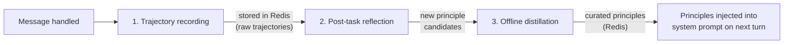

# Experience System (Self-Learning)

The experience system enables Orka agents to learn from their interactions over
time. It has three phases:



---

## Configuration

```toml
[experience]
enabled         = true       # off by default
reflect_on      = "failures" # "failures", "all", or "sampled"
max_principles  = 5          # max principles injected per turn
sample_rate     = 0.2        # fraction of tasks to reflect on (when reflect_on = "sampled")
```

| Key              | Default      | Description                                        |
| ---------------- | ------------ | -------------------------------------------------- |
| `enabled`        | `false`      | Enable the experience loop                         |
| `reflect_on`     | `"failures"` | Which tasks trigger reflection                     |
| `max_principles` | `5`          | Max principles injected into the system prompt     |
| `sample_rate`    | `0.1`        | Sampling probability when `reflect_on = "sampled"` |

---

## Phase 1: Trajectory Recording

After every handled message, the agent records a trajectory:

- The full conversation turn (user message + tool calls + responses + final reply)
- Whether the turn succeeded or failed (based on error rate and LLM self-assessment)
- Metadata: session ID, workspace name, timestamp, skill names used

Trajectories are stored in Redis under the `orka:experience:trajectories` key.

---

## Phase 2: Post-Task Reflection

Depending on `reflect_on`:

| Value        | Reflection triggered when…                               |
| ------------ | -------------------------------------------------------- |
| `"failures"` | The turn ended with an error or the LLM reported failure |
| `"all"`      | Every turn                                               |
| `"sampled"`  | Randomly, at `sample_rate` probability                   |

During reflection, a second LLM call analyses the trajectory and proposes
one or more **principle candidates** — short, actionable instructions in the
style of "When X, always Y".

Example principle candidates:

```
When using shell_exec, always check the exit code before proceeding.
Prefer read-only filesystem operations unless write access is explicitly requested.
```

---

## Phase 3: Offline Distillation

Distillation consolidates trajectory-derived candidates into a curated set of
principles. It can be triggered:

- **Manually** via the API or CLI:
  ```bash
  orka experience distill
  ```
- **Automatically** by the scheduler (configure a cron schedule for the
  `experience_distill` skill).

During distillation:

1. All accumulated candidates are loaded.
2. The LLM deduplicates and ranks them by utility.
3. The top-N principles (configurable) are persisted to Redis.
4. Old candidates are pruned.

---

## Prompt Injection

Before each LLM call, the `WorkspaceHandler` loads the current principles and
appends them to the system prompt under a `## Learned Principles` section:

```
## Learned Principles

1. When using shell_exec, always check the exit code before proceeding.
2. Prefer idempotent operations to avoid side effects on retry.
```

At most `max_principles` entries are injected to keep the prompt concise.

---

## CLI

```bash
# Check experience system status
orka experience status

# List current principles
orka experience principles

# Trigger distillation manually
orka experience distill
```

---

## API

| Method | Path                            | Description                 |
| ------ | ------------------------------- | --------------------------- |
| `GET`  | `/api/v1/experience/status`     | Status and trajectory count |
| `GET`  | `/api/v1/experience/principles` | Retrieve current principles |
| `POST` | `/api/v1/experience/distill`    | Trigger distillation        |

Example:

```bash
# Get principles
curl http://localhost:8080/api/v1/experience/principles | jq .

# Trigger distillation
curl -X POST http://localhost:8080/api/v1/experience/distill
```

---

## Tips

- Start with `reflect_on = "failures"` (default) to learn from mistakes without
  incurring extra LLM calls on every turn.
- Use `reflect_on = "sampled"` with `sample_rate = 0.1` for high-traffic agents
  to control reflection costs.
- Schedule nightly distillation for long-running agents:
  ```bash
  orka schedule create --cron "0 2 * * *" --skill experience_distill
  ```
- Inspect principles regularly with `orka experience principles` and trigger a
  new distillation if the quality degrades.
