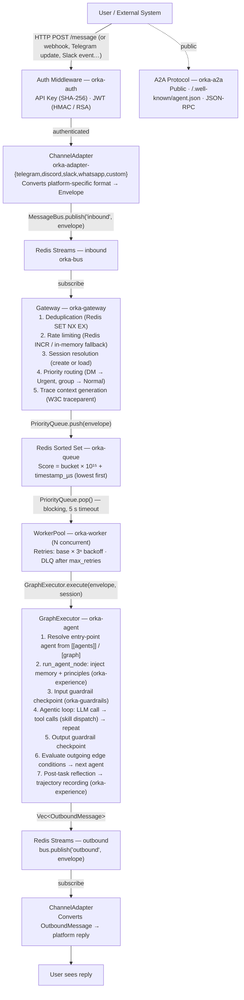
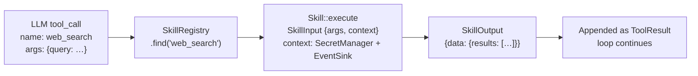

# Orka Architecture

End-to-end description of how a message flows through the Orka platform.

## High-level diagram

## Subsystems

### Message Bus (orka-bus)

Redis Streams back the `MessageBus` trait. Adapters publish inbound envelopes
to the `"inbound"` stream and subscribe to the `"outbound"` stream to deliver
replies. Each consumer group ensures at-most-once delivery per consumer.

### Priority Queue (orka-queue)

A Redis Sorted Set stores pending envelopes. The score encodes both priority
(`Urgent > Normal > Background`) and arrival time so higher-priority messages
are always processed first, with FIFO ordering within a priority tier.
Dead-letter entries are written to a separate key (`orka:dlq`).

### Session Store (orka-session)

Sessions are stored in Redis as JSON. A session represents a single user conversation
on a specific channel. It carries a `state` scratchpad that skills can read and
write for cross-turn memory within a session.

### Memory Store (orka-memory)

Long-term key-value memory, persisted in Redis. The `WorkspaceHandler` loads
relevant memory entries into the system prompt before each LLM call so the agent
has context from previous sessions.

### Knowledge / RAG (orka-knowledge)

Documents are embedded and stored in Qdrant (vector DB). At inference time,
a semantic search retrieves the most relevant passages, which are injected into
the system prompt. Ingestion pipelines can be triggered via the scheduler or
directly via the API.

### Experience System (orka-experience)

Three-phase self-learning loop:

1. **Trajectory recording** — after each task, the full interaction (messages,
   tool calls, outcomes) is serialized and stored.
2. **Online reflection** — immediately after task completion, an LLM call
   analyzes the trajectory and produces or updates _principles_ (heuristics
   about what worked and what didn't).
3. **Offline distillation** — a background job synthesizes patterns across
   many trajectories to produce higher-quality, cross-task principles.

Principles are injected into the system prompt alongside memory.

### Scheduler (orka-scheduler)

Cron-based task scheduler backed by a Redis Sorted Set. Tasks are stored with
their next-run timestamp as the score. A polling loop pops due tasks and
publishes them to the bus as `Payload::Event` envelopes.

### Guardrails (orka-guardrails)

Pre- and post-processing pipeline for `Envelope` and `OutboundMessage`.
Guardrails can block, modify, or log messages. Privileged command approval
is implemented here: commands matching a deny-list require explicit approval
before the sandbox executes them.

### Sandbox (orka-sandbox)

Isolated execution environment for the `shell` skill. Commands run in a
restricted process with configurable allow/deny lists. Execution results and
exit codes are emitted as `PrivilegedCommandExecuted` domain events.

### Secrets (orka-secrets)

`SecretManager` implementations: Redis backend with optional AES-256-GCM
encryption (default), and an in-memory backend for tests. The encryption key
is supplied via the `ORKA_SECRET_ENCRYPTION_KEY` env var; without it secrets
are stored in plaintext (development mode). Secrets are wrapped in
`SecretValue` which is `!Clone` and zeroizes on drop.

### MCP Server (orka-mcp)

Implements the [Model Context Protocol](https://modelcontextprotocol.io/) over JSON-RPC 2.0 via stdio. The MCP server exposes Orka's skill registry as MCP tools, allowing any MCP-compatible client (Claude Desktop, Cursor, etc.) to invoke Orka skills directly without going through the message bus.

### A2A Protocol (orka-a2a)

Agent-to-Agent communication protocol. Agents can delegate sub-tasks to other Orka agents (local or remote) by publishing structured `A2ARequest` envelopes to the bus. Responses are correlated back to the originating session. This enables multi-agent workflows where specialized agents collaborate to complete complex tasks.

### CLI (orka-cli)

Full management CLI for server administration, agent operations, and observability.

For a complete list of commands and global options, see the [CLI Reference](cli-reference.md).

The CLI is a thin shell around `orka-core` and `orka-workspace` — it shares configuration and type definitions with the server.

### Multi-Agent Graph Execution (orka-agent)

The `orka-agent` crate implements both single-agent and multi-agent graph
execution. In graph mode the topology is defined in `orka.toml` under
`[[agents]]` and `[graph]`. The executor:

1. Resolves the entry-point agent from `graph.entry` (falls back to the first `[[agents]]` entry).
2. Runs the node according to its `kind`:
   - `agent` — full LLM tool loop; `transfer_to_agent`/`delegate_to_agent` tools
     are auto-injected based on outgoing edges
   - `router` — evaluates edge conditions without calling the LLM
   - `fan_out` — dispatches to all successors in parallel
   - `fan_in` — waits for predecessors, then synthesizes results via LLM
3. Applies guardrail checkpoints (input, tool-call, output) for every node.
4. Evaluates outgoing edge conditions (`state_match`, `output_contains`, or
   `always`) to select the next agent.
5. Repeats until a terminal agent is reached or limits are hit
   (`max_total_iterations`, `max_total_tokens`, `max_duration_secs`).

Handoffs forward `context_transfer` data as an injected user message and apply
the per-agent `history_filter` (`full`, `last_n`, `none`) before the next LLM call.

### OS Integration (orka-os)

Provides OS-level skills when `os.enabled = true`:

- **shell** — Execute shell commands with allow/deny lists and configurable
  permission levels (`read-only` → `admin`).
- **file_read / file_write / file_list** — Filesystem access restricted to
  `os.allowed_paths`.
- **process_list** — List running processes.
- **coding_delegate** — Default routing entrypoint for coding tasks. It selects
  Claude Code or Codex according to `os.coding`.
- **sudo** — Privileged command execution gated by `os.sudo.allowed` and the sudo allowlist.

The coding-delegation path is split into three layers:

1. `coding_delegate` receives the task and applies Orka's routing policy.
2. A backend (`claude_code` or `codex`) builds a structured prompt and launches
   the corresponding CLI with the configured timeout, sandbox, and working directory.
3. The backend normalizes CLI output into a common Orka `SkillOutput` shape so
   the orchestrator does not depend on provider-specific event formats.

### HTTP Client (orka-http)

Provides an outbound `http_request` skill configured by the `http` section. Supports GET,
POST, PUT, PATCH, DELETE with configurable headers and body. SSRF protection
blocks requests to internal metadata endpoints. Response bodies are capped by
the runtime skill limits.

### Web Search & Read (orka-web)

Provides web search and page-reading skills when `web.search_provider` is
configured. Supported backends: `tavily`, `brave`, and `searxng`. The `web_read`
skill fetches and extracts text from a URL, respecting
`web.max_read_chars` and `web.read_timeout_secs`. Results are cached for
`web.cache_ttl_secs` seconds.

### LLM Router (orka-llm)

Multi-provider LLM client with model-name-based routing. Providers are keyed by
their configured model names, and the router falls back to the first provider
when no match is found.

Supports streaming responses (Server-Sent Events forwarded to the adapter), per-provider cost tracking, and configurable retry/timeout policies.

## Skill execution

Skills are invoked by the agentic loop when the LLM emits a tool call.
The flow:

Built-in skills live in `orka-skills`. External skills can be provided as
WASM plugins compiled with `orka-plugin-sdk`.

## Observability

Every significant event emits a `DomainEvent` to the `EventSink`. The
`orka-observe` crate subscribes to events and:

- Logs them via `tracing`
- Records metrics (token counts, latency, cost estimates)

## Configuration

Configuration is layered (later sources override earlier ones):

1. Default values (compiled in)
2. `orka.toml` (path from `ORKA_CONFIG` env var, default `./orka.toml`)
3. `ORKA__*` environment variables (double-underscore as separator)

The schema is versioned; `orka-core::migrate` handles upgrades automatically
on startup.
